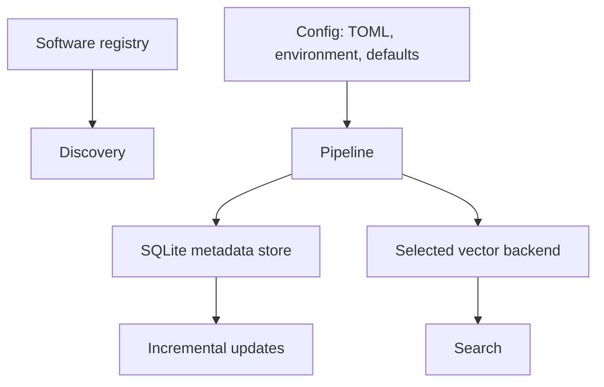

# Architecture

Every stage has an interface in `docforge.core.interfaces`. Providers can replace discovery, fetching, content extraction, chunking, embeddings, or vector storage without changing pipeline callers.

`full` indexing writes pages and vectors. `incremental` compares saved page state and processes only changes. `reembed` keeps crawled chunks and replaces embeddings with a new model.
