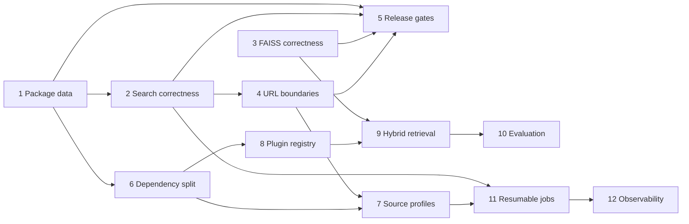

# DocForge — Post-v0.1 Improvement Plan

> Roadmap from working prototype to reliable, installable documentation indexing platform.

## Current baseline

DocForge v0.1.0 has a complete discovery-to-search pipeline, CLI and Python API, seven curated registry entries, five embedding providers, five vector backends, incremental updates, documentation, examples, and release automation.

Current local quality baseline:

- 461 tests pass, with one optional-backend test skipped.
- Coverage is above 80%.
- Ruff, mypy, and strict MkDocs builds pass.
- Main remaining risks are packaged-install correctness, search correctness, FAISS persistence/filtering, arbitrary-URL crawl boundaries, dependency weight, and limited retrieval evaluation.

Tasks are ordered by dependency. Complete Phase 1 before publishing v0.1.0.

---

## Phase 1 — Release blockers and correctness

### Task 1 — Make installed wheels self-contained

**Priority:** Critical
**Depends on:** Nothing

Registry files currently live outside `src/docforge`, while the wheel only packages `src/docforge`. An installed wheel may therefore fail to load the built-in registry outside a repository checkout.

**Implementation:**

- Move schema and built-in YAML entries into package data under `src/docforge/registry/`.
- Load packaged resources with `importlib.resources`; retain an explicit filesystem path for tests and user-supplied registries.
- Configure Hatch to include all registry JSON/YAML resources in wheel and sdist.
- Correct project URLs and maintainer metadata in `pyproject.toml` to use `aritra0309/DocForge`; remove placeholder domains and email addresses.
- Add a clean-install smoke test that builds a wheel, installs it into a temporary virtual environment, changes to an unrelated working directory, then verifies:
  - `docforge --version`
  - `docforge --help`
  - built-in registry contains all seven entries
  - `python -c "from docforge import DocForge"`

**Definition of done:**

- [ ] Wheel and sdist contain registry schema and seven YAML files.
- [ ] Registry loads without repository source tree or current-working-directory assumptions.
- [ ] Clean wheel smoke test runs in CI on Python 3.11, 3.12, and 3.13.
- [ ] Package metadata contains no placeholder URLs or contacts.

---

### Task 2 — Fix CLI and Python search version resolution

**Priority:** Critical
**Depends on:** Task 1

CLI search currently rejects every explicit `--version`, and `latest` resolves from the registry rather than the versions actually indexed locally.

**Implementation:**

- Create one shared version resolver used by CLI and Python API.
- Resolution rules:
  1. Explicit version must exist in local metadata or return a clear error listing indexed versions.
  2. `latest` or omitted version resolves to latest indexed version using `VersionManager` ordering.
  3. Missing software returns a clear “not indexed” error; registry membership is irrelevant during search.
- Require `software` consistently in CLI and Python search signatures.
- Make global `--config` effective for every command, or remove the global option and document command-level placement. Use one behavior, not both.
- Close embedding and storage resources in `finally` blocks when search, index, update, or re-embed fails.
- Add typed domain exceptions for not-indexed software, missing versions, invalid configuration, and backend initialization failures; translate them to concise CLI messages and nonzero exit codes.

**Definition of done:**

- [ ] `docforge search QUERY --software postgresql --version 17` succeeds when v17 is indexed.
- [ ] Omitted/`latest` version selects latest locally indexed version, even when registry latest differs.
- [ ] Invalid software/version errors list actionable next commands.
- [ ] Global configuration behavior is consistent and tested for every CLI command.
- [ ] Failed operations leave no open HTTP, embedding, database, or vector-store resources.

---

### Task 3 — Repair FAISS persistence and filtered search

**Priority:** Critical
**Depends on:** Nothing

FAISS IDs use Python `hash()`, which changes across processes, so persisted indexes may become unsearchable after restart. Filtering is applied only after unfiltered top-k retrieval, which can return too few matching results.

**Implementation:**

- Replace Python hashes with deterministic 63-bit IDs derived from SHA-256 chunk IDs.
- Persist an explicit numeric-ID-to-chunk-ID mapping and reject collisions during upsert.
- Add a storage format version to FAISS metadata.
- Detect legacy unversioned indexes and raise a clear migration error instructing the user to rebuild the affected collection; never silently discard it.
- For filtered searches, search enough candidates to return the true top-k matches within the filtered subset. Because current FAISS backend uses exact `IndexFlatIP`, scanning all stored candidates for filtered queries is acceptable.
- Add backend capability metadata for native filtering, persistence, bulk retrieval, and hybrid search. `StorageEngine` must branch on declared capability rather than assume uniform behavior.

**Definition of done:**

- [ ] FAISS index written in one process reloads and searches correctly in another process with a different hash seed.
- [ ] Upsert and delete remain correct after restart.
- [ ] Sparse filters return up to k matching results even when matches are outside unfiltered top-k.
- [ ] Legacy indexes fail with an actionable migration message.
- [ ] Every vector backend explicitly declares supported capabilities.

---

### Task 4 — Enforce safe crawl boundaries for direct URLs

**Priority:** Critical
**Depends on:** Task 2

Direct URL discovery currently limits crawling by domain only. Indexing a URL such as `https://docs.pytorch.org/docs/2.13/index.html` can escape `/docs/2.13/` and crawl other versions or projects on the same host.

**Public interface:**

```bash
docforge index URL --scope path
docforge index URL --scope domain
docforge index URL --include "/docs/2.13/**" --exclude "**/*.pdf"
```

`--scope path` is the default for direct URLs. Name-based registry discovery keeps registry-defined filters.

**Implementation:**

- Add `CrawlScope` enum with `path` and `domain` values.
- For direct URLs, derive a canonical base directory from the input URL and generate a default include glob for that path.
- Allow repeatable CLI/Python `include` and `exclude` overrides; validate patterns before network work begins.
- Preserve direct source URL, canonical software identifier, scope, and filters in metadata so updates use identical boundaries.
- Prevent redirects from escaping allowed host and scope unless explicitly configured.
- Add PyTorch as a curated registry entry with versioned `/docs/{version}/**` filtering and Sphinx content selectors.

**Definition of done:**

- [ ] Direct PyTorch 2.13 indexing never enqueues stable, nightly, assets, or other-version URLs.
- [ ] Domain scope works only when explicitly selected.
- [ ] Redirects and canonical links cannot bypass scope rules.
- [ ] Incremental update reuses original source boundary.
- [ ] PyTorch registry entry validates and indexes a bounded fixture successfully.

---

### Task 5 — Harden release gates

**Priority:** High
**Depends on:** Tasks 1–4

**Implementation:**

- Make release workflow run lint, typecheck, unit/integration tests, strict docs build, registry validation, wheel smoke test, and package metadata validation before publishing.
- Require tag version, `_version.py`, wheel metadata, and changelog version to match exactly.
- Use PyPI trusted publishing and a protected `pypi` environment.
- Generate GitHub release only after PyPI publish succeeds.
- Add manual TestPyPI workflow for release candidates.
- Publish provenance/attestations and retain wheel/sdist artifacts.

**Definition of done:**

- [ ] Invalid version/tag combinations fail before upload.
- [ ] TestPyPI installation passes clean-environment smoke test.
- [ ] Release cannot bypass tests or documentation validation.
- [ ] v0.1.0 can be installed and run outside repository checkout.

---

## Phase 2 — Install footprint and extensibility

### Task 6 — Split core and optional dependencies

**Priority:** High
**Depends on:** Task 1

Base install currently pulls local ML and multiple vector backends. Make core installation small while preserving a convenient default bundle.

**Target extras:**

- `docforge`: orchestration, HTTP crawling, extraction, models, CLI, and registry only.
- `docforge[local]`: Sentence Transformers + ChromaDB default local experience.
- `docforge[faiss]`, `[qdrant]`, `[lancedb]`, `[weaviate]`: one vector backend each.
- `docforge[openai]`, `[voyage]`, `[jina]`, `[bge]`: one embedding provider each.
- `docforge[all]`: all supported providers/backends.
- `docforge[dev]` and `[docs]`: contributor tooling.

**Implementation:**

- Remove duplicated requirements and move provider/backend imports behind factories.
- Raise `MissingExtraError` with exact install command when selected dependency is absent.
- Keep provider modules importable without importing heavyweight optional libraries until instantiated.
- Document one recommended local installation and one remote-service installation.

**Definition of done:**

- [ ] Core wheel installs without Torch, Sentence Transformers, FAISS, or ChromaDB.
- [ ] Each extra has an isolated import/initialization test.
- [ ] Missing extras produce actionable errors, never raw `ImportError` traces.
- [ ] `local` extra supports complete index-and-search workflow.

---

### Task 7 — Add custom source profiles

**Priority:** High
**Depends on:** Tasks 4 and 6

Users should support arbitrary documentation without editing repository registry files.

**Public interface:**

```bash
docforge source add pytorch \
  --url https://docs.pytorch.org/docs/2.13/ \
  --include "/docs/2.13/**" \
  --selector-main ".bd-main"
docforge source list
docforge source inspect pytorch
docforge index pytorch
```

Python API gains `SourceProfile` and `DocForge.add_source(profile)`.

**Implementation:**

- Store user profiles in `~/.config/docforge/sources/` as schema-validated YAML.
- Precedence: explicit API/CLI source options, project profiles, user profiles, built-in registry, heuristic discovery.
- Add `source validate` that probes URL, robots policy, selector match, sitemap availability, and estimated crawl scope without indexing.
- Never store authentication secrets in profile YAML; resolve secret references from environment variables.

**Definition of done:**

- [ ] Unknown static documentation site can be configured, validated, indexed, updated, and searched without code changes.
- [ ] Profile precedence is deterministic and tested.
- [ ] Invalid selectors, filters, URLs, or secret references fail before crawling.
- [ ] Built-in registry behavior remains backward compatible.

---

### Task 8 — Stabilize plugin registration

**Priority:** Medium
**Depends on:** Task 6

**Implementation:**

- Replace hardcoded provider/backend conditionals with typed registries.
- Support third-party plugins through Python entry points:
  - `docforge.embedding_providers`
  - `docforge.vector_stores`
  - `docforge.chunkers`
  - `docforge.extractors`
- Require plugin name, version, capabilities, configuration model, and factory.
- Detect duplicate names and incompatible DocForge versions at startup.
- Add `docforge plugins list` and `docforge plugins inspect NAME`.

**Definition of done:**

- [ ] Built-in providers use same registration path as third-party plugins.
- [ ] Fixture plugin installed in isolated environment is discovered and used end to end.
- [ ] Duplicate/incompatible plugins fail with clear diagnostics.
- [ ] Plugin import failure does not break unrelated built-in providers.

---

## Phase 3 — Retrieval quality

### Task 9 — Add hybrid retrieval and optional reranking

**Priority:** High
**Depends on:** Tasks 3 and 8

Dense retrieval alone is weak for exact API symbols, error codes, and configuration keys.

**Public interface:**

```bash
docforge search "torch.nn.Module" --software pytorch --retrieval hybrid
docforge search "connection reset" --software postgresql --rerank cross-encoder
```

Python search adds `retrieval: Literal["dense", "keyword", "hybrid"]`, `reranker`, and `fetch_k`; existing defaults remain dense with no reranker.

**Implementation:**

- Add local BM25 keyword index per software/version/model collection.
- Fuse dense and keyword rankings with Reciprocal Rank Fusion.
- Add optional cross-encoder reranker behind an extra; rerank `fetch_k`, return final `k`.
- Preserve source metadata, deterministic ordering for equal scores, and backend-independent filter semantics.
- Report dense, keyword, fused, and rerank scores in debug output while keeping public `score` normalized.

**Definition of done:**

- [ ] Exact symbol and error-code queries improve over dense-only baseline on evaluation set.
- [ ] Hybrid results honor software/version/page-type filters.
- [ ] Dense-only API remains backward compatible.
- [ ] Search latency targets are documented for dense, hybrid, and reranked modes.

---

### Task 10 — Build a regression-quality evaluation suite

**Priority:** High
**Depends on:** Task 9

**Implementation:**

- Expand evaluation dataset across all built-in software and page types with query, relevant URLs/sections, and relevance grades.
- Track Recall@5, Recall@10, MRR@10, nDCG@10, indexing throughput, index size, and p50/p95 search latency.
- Add golden chunk-boundary fixtures for every chunking strategy.
- Add cross-backend contract suite covering upsert, restart persistence, filters, deletes, top-k ordering, and capability declarations.
- Store a versioned baseline; CI fails only on statistically meaningful regression thresholds.
- Publish evaluation summary as CI artifact and release-note input.

**Definition of done:**

- [ ] Every built-in software has at least ten graded queries.
- [ ] Every chunker has deterministic golden-output coverage.
- [ ] All available backends run same contract tests.
- [ ] CI blocks retrieval regressions beyond documented tolerance.

---

## Phase 4 — Operations and resilience

### Task 11 — Add resumable jobs and bounded failure handling

**Priority:** Medium
**Depends on:** Tasks 2 and 7

**Implementation:**

- Assign stable job IDs and persist stage checkpoints, source profile snapshot, counters, and last error.
- Add `docforge jobs list`, `jobs inspect`, `jobs resume`, and `jobs cancel`.
- Make each stage idempotent so resume cannot duplicate chunks or metadata.
- Add configurable failure budget by absolute count and percentage; fail job when exceeded.
- Handle SIGINT/SIGTERM by finishing current atomic write, recording interrupted state, and exiting with documented code.

**Definition of done:**

- [ ] Interrupted 1,000-page fixture crawl resumes without refetching completed pages.
- [ ] Resume produces same final chunk IDs and counts as uninterrupted run.
- [ ] Failure budget behavior is deterministic and visible in job status.
- [ ] Cancelled/interrupted jobs leave searchable committed data consistent.

---

### Task 12 — Add observability and diagnostics

**Priority:** Medium
**Depends on:** Task 11

**Implementation:**

- Standardize structured logs with job, software, version, URL, stage, provider, backend, duration, and retry fields.
- Add `--log-format text|json` and `--log-level` CLI options.
- Add `docforge doctor` to check configuration, data-directory permissions, optional dependencies, model availability, backend connectivity, registry/profile validity, and pending migrations.
- Emit OpenTelemetry spans and metrics through an optional extra; default remains dependency-free logging.
- Redact API keys, authorization headers, and secret environment values from logs and errors.

**Definition of done:**

- [ ] One job can be traced across all pipeline stages by job ID.
- [ ] `docforge doctor` catches missing extras, bad paths, invalid profiles, and backend failures before indexing.
- [ ] Secret-redaction tests cover logs, exceptions, and JSON output.
- [ ] Observability is optional and adds no base-install dependencies.

---

## Release milestones

### v0.1.0 — Reliable first release

- Tasks 1–5 complete.
- Clean PyPI/TestPyPI installation verified.
- Direct URLs have safe path-scoped crawling.
- Explicit and latest-version search work correctly.

### v0.2.0 — Extensible indexing

- Tasks 6–8 complete.
- Lightweight core install and custom source profiles available.
- Third-party provider registration stable.

### v0.3.0 — Retrieval quality

- Tasks 9–10 complete.
- Hybrid retrieval ships with measured quality baselines.

### v0.4.0 — Operational resilience

- Tasks 11–12 complete.
- Jobs are resumable, diagnosable, and observable.

---

## Dependency graph



## Global completion rules

Every task must include:

- Unit tests for new logic and failure paths.
- Integration test for user-visible workflow.
- Public API and CLI documentation updates.
- Changelog entry under unreleased version.
- Ruff, mypy, full non-network test suite, strict docs build, and wheel smoke test passing.
- No silent fallback when correctness or data integrity would change.
